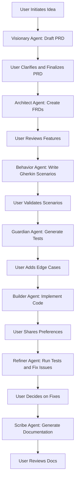
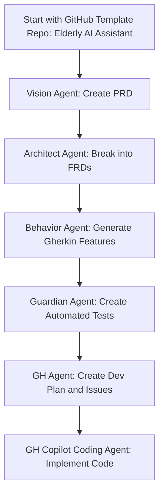

# ai-dev-template-copilot

### 🧠 Phase 1: Idea-to-Product Flow

Scaffold the flow and use the agent to produce the personas and their prompts

---

### 🚀 Phase 2: Dev Team Flow with GitHub Integration

This phase shows how the team uses a preconfigured GitHub template to kickstart development:

