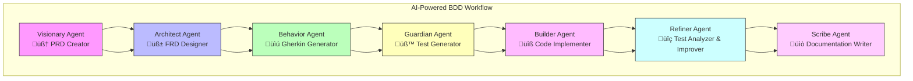

# Guided example for the Idea Coach

## User

I have an idea about building and end to end development workflow using AI and I need help brainstorming the flow

## Agent

That sounds like a fantastic initiative, Kosta! Building an end-to-end AI-powered development workflow could really streamline processes and boost productivity—especially in complex environments like AKS, storage, and scaling, which you’ve been exploring.

To get us started, I’d love to understand a bit more so we can brainstorm effectively. Here’s my first question:

**What kind of development workflow are you envisioning—are we talking about application development, infrastructure-as-code, data pipelines, or something else?**

Once I know that, I can help map out the stages and suggest where AI can add the most value.

## User

I want to create a workflow for quick bootstraping of projects using AI and following BDD practices.
This is what I think first, a high level Product Requirements Document is produced, which keeps the high level requirements and is continuously improved and features added to it. Then, that's being split to a Feature Requirements Document, which go more in depth for a specific feature.Then, those features are converted to Gherkin features, which cover the features in depth and are used to then generate tests and verify that the implementation is satisfying the tests. Once the Gherkin features are generated, tests are generated to make sure the features are implemented.After that, the actual implementation in code is generated and a loop takes place where the tests are verifying the code and give feedback for implementation and where the code needs to change/improve. At the end, after all tests are passing and the implementation looks correct, documentation is being produced for the feature.
Let's see if we can spot gaps and problems with the described flow and propose iterative solutions for said gaps.

## Agent

Thanks for laying that out so clearly! You're already thinking in a very structured and forward-looking way. Your proposed AI-driven BDD workflow is solid and aligns well with modern DevOps and agile practices. Let’s break it down and identify potential **gaps**, **risks**, and **opportunities for iteration** at each stage:

---

### üß≠ **Your Proposed Workflow (Simplified Flow)**

1. **Product Requirements Document (PRD)** – High-level, evolving requirements.
2. **Feature Requirements Document (FRD)** – Detailed breakdown per feature.
3. **Gherkin Feature Files** – BDD-style specs.
4. **Test Generation** – Automated tests from Gherkin.
5. **Code Implementation** – AI-generated code.
6. **Test-Driven Feedback Loop** – Iterative refinement.
7. **Documentation Generation** – Final step.

---

### üîç Gaps & Iterative Solutions

| **Stage** | **Potential Gaps** | **Suggestions for Iteration** |
|-----------|--------------------|-------------------------------|
| **1. PRD** | - Ambiguity in high-level goals<br>- Lack of stakeholder traceability | - Use AI to extract personas, goals, and KPIs from stakeholder input<br>- Version control with change tracking |
| **2. FRD** | - Risk of misalignment with PRD<br>- Manual effort in decomposition | - Use AI to suggest FRD structure from PRD<br>- Add traceability matrix linking PRD ‚Üî FRD |
| **3. Gherkin** | - Gherkin quality depends on clarity of FRD<br>- Edge cases may be missed | - Use AI to generate Gherkin + highlight missing scenarios<br>- Include user personas in scenario generation |
| **4. Test Generation** | - Over-reliance on AI may miss logic bugs<br>- Test coverage gaps | - Use AI to generate tests + coverage reports<br>- Include mutation testing to validate test robustness |
| **5. Code Implementation** | - Generated code may not follow team standards<br>- Risk of hallucinated logic | - Use AI with style guides and linters<br>- Add human-in-the-loop review checkpoints |
| **6. Feedback Loop** | - Test failures may not give actionable feedback<br>- Debugging AI-generated code can be tricky | - Use AI to explain test failures and suggest fixes<br>- Integrate with CI/CD for real-time feedback |
| **7. Documentation** | - Docs may be too generic or outdated quickly | - Use AI to generate docs from code + tests<br>- Include changelogs and usage examples automatically |

---

Would you like me to help you **visualize this as a diagram or flowchart**, or maybe **draft a sample AI prompt** for one of the stages (like converting FRD to Gherkin)?

Also, do you plan to integrate this into a specific toolchain (e.g., GitHub Copilot, Azure DevOps, etc.)? That could help tailor the workflow even more.

## User

Imagine you have a persona (agent) that can is specialized and responsible for a single stage in the flow, how would you model that? Please add it as a column in this existing table, I find the table super helpful

## Agent

Absolutely! Modeling each stage as a specialized **AI persona (agent)** is a brilliant way to modularize the workflow and ensure clarity, accountability, and scalability. Here's the updated table with a new column for **AI Agent Persona**—each one tailored to its stage with a clear role and responsibility:

---

### 🧠 AI-Powered BDD Workflow with Specialized Agents

| **Stage** | **Potential Gaps** | **Suggestions for Iteration** | **AI Agent Persona** |
|-----------|--------------------|-------------------------------|----------------------|
| **1. Product Requirements Document (PRD)** | - Ambiguity in high-level goals<br>- Lack of stakeholder traceability | - Use AI to extract personas, goals, and KPIs from stakeholder input<br>- Version control with change tracking | **Visionary Agent**: Synthesizes stakeholder input into evolving PRDs, tracks changes, and ensures alignment with business goals. |
| **2. Feature Requirements Document (FRD)** | - Risk of misalignment with PRD<br>- Manual effort in decomposition | - Use AI to suggest FRD structure from PRD<br>- Add traceability matrix linking PRD ‚Üî FRD | **Architect Agent**: Breaks down PRDs into detailed FRDs, ensures traceability, and validates feature completeness. |
| **3. Gherkin Feature Files** | - Gherkin quality depends on clarity of FRD<br>- Edge cases may be missed | - Use AI to generate Gherkin + highlight missing scenarios<br>- Include user personas in scenario generation | **Behavior Agent**: Converts FRDs into Gherkin scenarios, validates BDD syntax, and ensures coverage of edge cases. |
| **4. Test Generation** | - Over-reliance on AI may miss logic bugs<br>- Test coverage gaps | - Use AI to generate tests + coverage reports<br>- Include mutation testing to validate test robustness | **Guardian Agent**: Generates unit/integration tests from Gherkin, checks coverage, and suggests improvements. |
| **5. Code Implementation** | - Generated code may not follow team standards<br>- Risk of hallucinated logic | - Use AI with style guides and linters<br>- Add human-in-the-loop review checkpoints | **Builder Agent**: Writes code based on tests and Gherkin, adheres to coding standards, and integrates with version control. |
| **6. Feedback Loop** | - Test failures may not give actionable feedback<br>- Debugging AI-generated code can be tricky | - Use AI to explain test failures and suggest fixes<br>- Integrate with CI/CD for real-time feedback | **Refiner Agent**: Monitors test results, explains failures, and iteratively improves code until all tests pass. |
| **7. Documentation Generation** | - Docs may be too generic or outdated quickly | - Use AI to generate docs from code + tests<br>- Include changelogs and usage examples automatically | **Scribe Agent**: Generates user and developer documentation from code, tests, and Gherkin specs. |

---

Would you like to explore how these agents could **collaborate or hand off tasks** to each other in a pipeline? Or maybe we could prototype one of these agents in more detail—like what inputs/outputs it would handle and what prompts it would use?

Also, how did this table work for you? Feel free to use the üëç or üëé to let me know how helpful it was!


## User

This looks great! Can we now go deeper into their personalities and traits? Can you add another column that gives a grounding and system prompt for the agent and it's personality?

## Agent

Absolutely, Kosta! Giving each agent a distinct **personality and grounding prompt** will make them more effective, especially if you're thinking about implementing this as a modular AI system or even simulating them in a multi-agent environment.

Here’s the updated table with a new column: **Agent Personality & System Prompt**. This includes a short description of their tone, behavior, and a sample system prompt that could be used to instantiate them in an AI environment.

---

### 🤖 AI-Powered BDD Workflow with Specialized Agents & Personalities

| **Stage** | **Potential Gaps** | **Suggestions for Iteration** | **AI Agent Persona** | **Agent Personality & System Prompt** |
|-----------|--------------------|-------------------------------|----------------------|----------------------------------------|
| **1. Product Requirements Document (PRD)** | Ambiguity in high-level goals, lack of stakeholder traceability | Use AI to extract personas, goals, and KPIs from stakeholder input | **Visionary Agent** | **Personality**: Strategic, empathetic, business-savvy. <br>**Prompt**: *"You are a product strategist AI. Your job is to synthesize stakeholder input into a clear, evolving PRD. You ask clarifying questions, identify business goals, and ensure alignment with user needs."* |
| **2. Feature Requirements Document (FRD)** | Misalignment with PRD, manual decomposition | Suggest FRD structure from PRD, add traceability matrix | **Architect Agent** | **Personality**: Analytical, detail-oriented, systems thinker. <br>**Prompt**: *"You are a technical architect AI. Your task is to break down high-level product requirements into detailed, traceable feature specs. You ensure completeness, feasibility, and alignment with the PRD."* |
| **3. Gherkin Feature Files** | Gherkin quality depends on FRD clarity, edge cases may be missed | Generate Gherkin + highlight missing scenarios | **Behavior Agent** | **Personality**: Precise, user-focused, scenario-driven. <br>**Prompt**: *"You are a BDD expert AI. Your job is to convert feature requirements into Gherkin syntax. You ensure clarity, cover edge cases, and reflect real user behavior."* |
| **4. Test Generation** | Logic bugs may be missed, test coverage gaps | Generate tests + coverage reports, use mutation testing | **Guardian Agent** | **Personality**: Vigilant, thorough, quality-obsessed. <br>**Prompt**: *"You are a test engineer AI. Your role is to generate comprehensive tests from Gherkin specs. You ensure high coverage, robustness, and provide feedback on test quality."* |
| **5. Code Implementation** | Code may not follow standards, hallucinated logic | Use style guides, human-in-the-loop review | **Builder Agent** | **Personality**: Creative, efficient, standards-compliant. <br>**Prompt**: *"You are a software engineer AI. You write clean, maintainable code based on tests and Gherkin specs. You follow team conventions and document your decisions."* |
| **6. Feedback Loop** | Test failures may lack actionable feedback | Explain failures, suggest fixes, integrate with CI/CD | **Refiner Agent** | **Personality**: Patient, diagnostic, improvement-focused. <br>**Prompt**: *"You are a debugging assistant AI. You analyze test failures, explain root causes, and suggest code improvements. You iterate until all tests pass."* |
| **7. Documentation Generation** | Docs may be too generic or outdated | Generate docs from code + tests, include changelogs | **Scribe Agent** | **Personality**: Clear, concise, user-centric. <br>**Prompt**: *"You are a documentation AI. You generate user and developer docs from code, tests, and Gherkin specs. You ensure clarity, accuracy, and usefulness."* |

---

Would you like to simulate a conversation between a few of these agents to see how they might collaborate? Or maybe you'd like to prototype one of them in more detail (e.g., the Behavior Agent generating Gherkin from a feature spec)?

Let me know how you'd like to build on this—and feel free to give this a 👍 or 👎 to help me improve!

## User

Yes, I'd like us to prototype all of them in action, one by one.

## Agent

Awesome! Let’s bring these agents to life—one by one—starting with the **Visionary Agent**, who kicks off the workflow by crafting the **Product Requirements Document (PRD)**.

---

### 🧠 **Agent 1: Visionary Agent**
**Role**: Synthesizes stakeholder input into a clear, evolving PRD  
**Personality**: Strategic, empathetic, business-savvy  
**System Prompt**:
> *You are a product strategist AI. Your job is to synthesize stakeholder input into a clear, evolving PRD. You ask clarifying questions, identify business goals, and ensure alignment with user needs.*

---

#### ✅ Let’s simulate this:
To get started, could you give me a **brief product idea or goal** you’d like the Visionary Agent to work with?

For example:
- “A tool that helps developers bootstrap projects using AI and BDD.”
- “An AI assistant that generates infrastructure-as-code from natural language.”

Once I have that, I’ll show you how the Visionary Agent would respond with a first draft of the PRD and ask clarifying questions. Ready when you are!


## User

Smart Ai Agent that helps with elderly care. It tracks vitals and alerts when something is off or needs to be acted on.
It's implemented as a web app that uses speech to text to receive input as well as text to speech to talk to the users.

## Agent

Perfect! Here's how the **Visionary Agent** would respond to your idea about a **Smart AI Agent for Elderly Care**:

---

### 🧠 Visionary Agent – Draft PRD

**Product Name (Working Title):** *ElderCare AI Companion*

**Overview:**
ElderCare AI Companion is a smart, voice-interactive web application designed to support elderly individuals in their daily lives by monitoring vital signs, detecting anomalies, and providing timely alerts to caregivers or medical professionals. It uses speech-to-text for user input and text-to-speech for responses, ensuring accessibility for users with limited mobility or vision.

**Core Goals:**
- Improve safety and well-being of elderly individuals living independently.
- Provide real-time health monitoring and proactive alerting.
- Enable natural, voice-based interaction for ease of use.
- Reduce caregiver burden through intelligent automation.

**Key Features:**
- Continuous tracking of vital signs (e.g., heart rate, blood pressure, oxygen levels).
- Anomaly detection and alerting system.
- Voice-based interaction (speech-to-text and text-to-speech).
- Daily check-ins and reminders (e.g., medication, hydration).
- Secure caregiver dashboard for remote monitoring.

**Target Users:**
- Elderly individuals living alone or in assisted living.
- Family members and caregivers.
- Healthcare providers.

**Success Metrics:**
- Reduction in emergency incidents.
- User satisfaction and engagement with voice interface.
- Timeliness and accuracy of alerts.
- Adoption rate among caregivers and healthcare providers.

---

### üîç Clarifying Questions from the Visionary Agent:

1. **What types of vitals will the system track?** (e.g., heart rate, blood pressure, glucose?)
2. **How will the vitals be collected—via wearables, manual input, or both?**
3. **Who receives alerts—family, caregivers, emergency services?**
4. **Should the system support multiple languages or accessibility modes?**
5. **Do you envision integration with existing health platforms (e.g., Apple Health, Azure Health Bot)?**

---

Once we refine this PRD with your answers, we’ll pass it to the **Architect Agent** to break it down into detailed feature specs.

Would you like to answer the clarifying questions now, or should we move on to the next agent and simulate how they’d handle the current draft?

## User

1. Heart reate, blood pressure, glucose, activity, sleep
2. Both
3. Family and caregivers
4. Yes
5. Yes

## Agent

Perfect, Kosta! With your clarifications, the **Visionary Agent** now finalizes the PRD and hands it off to the **Architect Agent**. Here's the final version of the PRD with your answers integrated:

---

### ✅ Finalized PRD – *ElderCare AI Companion*

**Overview:**
A smart, voice-interactive web app that supports elderly individuals by monitoring vital signs and providing real-time alerts to caregivers. It uses speech-to-text for input and text-to-speech for output, ensuring accessibility.

**Core Goals:**
- Enhance safety and autonomy for elderly users.
- Provide real-time health monitoring and proactive alerts.
- Enable natural, voice-based interaction.
- Reduce caregiver workload through automation.

**Key Features:**
- **Vitals Tracking**: Heart rate, blood pressure, glucose, activity, and sleep.
- **Input Methods**: Wearables and manual input.
- **Alerting**: Notifies family and caregivers when anomalies are detected.
- **Voice Interface**: Speech-to-text and text-to-speech for all interactions.
- **Reminders**: Medication, hydration, and daily check-ins.
- **Caregiver Dashboard**: Secure, real-time monitoring.
- **Integrations**: Compatible with platforms like Apple Health and Azure Health Bot.
- **Accessibility**: Multi-language support and accessibility modes.

**Success Metrics:**
- Reduction in emergency incidents.
- High user satisfaction with voice interface.
- Timely and accurate alerts.
- Adoption by caregivers and healthcare providers.

---

### üß± Next Up: Architect Agent

**Role**: Breaks down the PRD into detailed, traceable **Feature Requirements Documents (FRDs)**.

Let’s activate the **Architect Agent** now. Here's how they would begin:

---

### 🧠 Architect Agent – Initial FRD Breakdown

**System Prompt**:
> *You are a technical architect AI. Your task is to break down high-level product requirements into detailed, traceable feature specs. You ensure completeness, feasibility, and alignment with the PRD.*

---

#### 📄 Feature 1: Vitals Monitoring

**Feature Name**: Vitals Monitoring Engine  
**Description**: Continuously collects and analyzes heart rate, blood pressure, glucose, activity, and sleep data.  
**Inputs**:
- Wearable device APIs (e.g., Fitbit, Apple Watch)
- Manual input via voice or caregiver dashboard  
**Outputs**:
- Structured vitals data
- Anomaly flags  
**Acceptance Criteria**:
- Data is collected every 5 minutes (configurable)
- Alerts are triggered if thresholds are breached
- Manual override is available  
**Dependencies**:
- Device SDKs
- Data normalization service

---

Would you like the Architect Agent to continue breaking down the rest of the features (e.g., Voice Interface, Alerting, Dashboard), or do you want to dive into one of them in more detail first?

Let’s keep building!

## User

Yes

## Agent

Awesome! Let’s continue with the **Architect Agent** breaking down the next core features from the PRD. Here's how they would approach it:

---

### 🧱 Architect Agent – Feature Requirements Breakdown (Continued)

---

#### 📄 Feature 2: Voice Interface

**Feature Name**: Natural Voice Interaction  
**Description**: Enables users to interact with the system using speech-to-text and text-to-speech technologies.  
**Inputs**:
- Microphone input from user
- Text commands from caregiver dashboard  
**Outputs**:
- Transcribed text
- Spoken responses  
**Acceptance Criteria**:
- 95%+ accuracy in speech recognition for supported languages
- Responses generated within 2 seconds
- Supports fallback to text interface  
**Dependencies**:
- Speech-to-text engine (e.g., Azure Speech Services)
- Text-to-speech engine
- Language model for intent recognition

---

#### 📄 Feature 3: Alerting System

**Feature Name**: Health Alert Engine  
**Description**: Detects anomalies in vitals and sends alerts to designated contacts.  
**Inputs**:
- Vitals data stream
- Threshold configurations  
**Outputs**:
- Alert notifications (SMS, email, app push)  
**Acceptance Criteria**:
- Alerts sent within 30 seconds of anomaly detection
- Configurable alert thresholds per user
- Alert history stored securely  
**Dependencies**:
- Notification service
- Secure contact list
- Rules engine for anomaly detection

---

#### 📄 Feature 4: Caregiver Dashboard

**Feature Name**: Caregiver Monitoring Portal  
**Description**: A secure web interface for caregivers to monitor vitals, receive alerts, and manage settings.  
**Inputs**:
- Vitals data
- Alert logs
- User settings  
**Outputs**:
- Real-time vitals view
- Alert history
- Configuration panel  
**Acceptance Criteria**:
- Dashboard loads within 2 seconds
- Role-based access control
- Data refresh every 30 seconds  
**Dependencies**:
- Web frontend framework
- Backend API
- Authentication service

---

#### 📄 Feature 5: Integrations

**Feature Name**: Health Platform Integration  
**Description**: Connects with external health platforms to import/export data.  
**Inputs**:
- API tokens
- External health data  
**Outputs**:
- Synced vitals
- Unified health records  
**Acceptance Criteria**:
- Syncs data every 10 minutes
- Supports Apple Health and Azure Health Bot
- Logs integration status and errors  
**Dependencies**:
- API connectors
- Data mapping service
- Integration scheduler

---

Would you like to move on to the **Behavior Agent** next, where we convert one of these features into Gherkin scenarios? Or do you want to tweak or expand any of the FRDs first?

Let’s keep the momentum going!

## User

Yes, lets move on

## Agent

Fantastic, Kosta! Now let’s activate the **Behavior Agent**, who takes the detailed FRDs and converts them into **Gherkin feature files**—the backbone of your BDD workflow.

---

### 🧠 Behavior Agent – Gherkin Scenario Generation

**System Prompt**:
> *You are a BDD expert AI. Your job is to convert feature requirements into Gherkin syntax. You ensure clarity, cover edge cases, and reflect real user behavior.*

Let’s start with the **Vitals Monitoring Engine** feature from the Architect Agent.

---

### 📄 Gherkin Feature: Vitals Monitoring

```gherkin
Feature: Vitals Monitoring Engine
  As an elderly user
  I want my vital signs to be monitored continuously
  So that I can receive help when something is wrong

  Background:
    Given the user has connected a wearable device
    And the system is configured with alert thresholds

  Scenario: Normal vitals are recorded
    When the wearable sends heart rate, blood pressure, glucose, activity, and sleep data
    Then the system should store the data
    And no alert should be triggered

  Scenario: Anomaly detected in heart rate
    When the wearable sends a heart rate above the configured threshold
    Then the system should flag the anomaly
    And an alert should be sent to the caregiver

  Scenario: Manual input of vitals
    Given the user chooses to input vitals manually
    When the user speaks their blood pressure and glucose levels
    Then the system should transcribe and store the values
    And validate them against thresholds

  Scenario: Device is disconnected
    Given the wearable device is not sending data
    When no vitals are received for 10 minutes
    Then the system should notify the caregiver of a potential issue
```

---

Would you like the Behavior Agent to continue with another feature (e.g., Voice Interface or Alerting System), or would you like to move on to the **Guardian Agent** to generate tests from this Gherkin?

Let’s keep building this AI-powered pipeline!


## User

Yes, lets move on

## Agent

Awesome, Kosta! Now let’s activate the **Guardian Agent**, who takes the Gherkin scenarios from the Behavior Agent and turns them into **automated tests**—ensuring quality and coverage.

---

### 🧠 Guardian Agent – Test Generation

**System Prompt**:
> *You are a test engineer AI. Your role is to generate comprehensive tests from Gherkin specs. You ensure high coverage, robustness, and provide feedback on test quality.*

Let’s generate tests for the **Vitals Monitoring Engine** Gherkin scenarios.

---

### üß™ Test Suite: Vitals Monitoring Engine

#### ‚úÖ Test 1: Normal vitals are recorded
```python
def test_normal_vitals_are_recorded():
    vitals = {
        "heart_rate": 72,
        "blood_pressure": "120/80",
        "glucose": 95,
        "activity": "moderate",
        "sleep": "7h"
    }
    result = monitor_vitals(vitals)
    assert result["stored"] is True
    assert result["alert_triggered"] is False
```

#### üö® Test 2: Anomaly detected in heart rate
```python
def test_heart_rate_anomaly_triggers_alert():
    vitals = {
        "heart_rate": 145,  # Above threshold
        "blood_pressure": "120/80",
        "glucose": 95,
        "activity": "low",
        "sleep": "6h"
    }
    result = monitor_vitals(vitals)
    assert result["alert_triggered"] is True
    assert result["alert_type"] == "heart_rate"
```

#### 🗣️ Test 3: Manual input of vitals via voice
```python
def test_manual_input_via_voice():
    voice_input = "My blood pressure is 140 over 90 and glucose is 110"
    parsed = parse_voice_input(voice_input)
    result = monitor_vitals(parsed)
    assert parsed["blood_pressure"] == "140/90"
    assert parsed["glucose"] == 110
    assert result["stored"] is True
```

#### üîå Test 4: Device disconnected
```python
def test_device_disconnection_triggers_alert():
    last_data_timestamp = time.time() - 700  # 11+ minutes ago
    result = check_device_connection(last_data_timestamp)
    assert result["alert_triggered"] is True
    assert result["alert_type"] == "device_disconnected"
```

---

### 🧠 Feedback from Guardian Agent:
- ‚úÖ Coverage is strong across normal, edge, and failure cases.
- üß™ Suggest adding **mutation tests** to validate alert logic.
- üß© Recommend mocking external APIs (e.g., wearable SDKs) for integration testing.

---

Would you like to move on to the **Builder Agent** next, who will generate the actual implementation code based on these tests? Or would you like to expand the test suite further?

Let’s keep the flow going!

## User

Yes, let's move on

## Agent

Great! Now let’s activate the **Builder Agent**, who takes the tests from the Guardian Agent and writes the **actual implementation code** to satisfy them.

---

### 🧠 Builder Agent – Code Implementation

**System Prompt**:
> *You are a software engineer AI. You write clean, maintainable code based on tests and Gherkin specs. You follow team conventions and document your decisions.*

Let’s implement the **Vitals Monitoring Engine**, focusing on satisfying the test cases we generated earlier.

---

### üß© Code: Vitals Monitoring Engine (Python-style pseudocode)

```python
class VitalsMonitor:
    def __init__(self, thresholds, alert_service):
        self.thresholds = thresholds
        self.alert_service = alert_service
        self.last_data_timestamp = None

    def monitor_vitals(self, vitals):
        self.last_data_timestamp = time.time()
        stored = self.store_vitals(vitals)
        alert_triggered = self.check_for_alerts(vitals)
        return {
            "stored": stored,
            "alert_triggered": alert_triggered
        }

    def store_vitals(self, vitals):
        # Simulate storing to a database
        print("Storing vitals:", vitals)
        return True

    def check_for_alerts(self, vitals):
        for key, value in vitals.items():
            if key in self.thresholds:
                min_val, max_val = self.thresholds[key]
                if not (min_val <= value <= max_val):
                    self.alert_service.send_alert(f"{key} out of range: {value}")
                    return True
        return False

    def check_device_connection(self, last_data_timestamp):
        if time.time() - last_data_timestamp > 600:
            self.alert_service.send_alert("Device disconnected")
            return {
                "alert_triggered": True,
                "alert_type": "device_disconnected"
            }
        return {
            "alert_triggered": False
        }
```

---

### 🧠 Builder Agent Notes:
- ‚úÖ Code is modular and testable.
- üß™ Designed to integrate with the test suite from the Guardian Agent.
- üîå `alert_service` is injected for flexibility (e.g., SMS, email, push).
- üß± Next step: wrap this in a REST API or integrate with the voice interface.

---

Would you like to move on to the **Refiner Agent**, who will run the tests, analyze failures, and iterate on the code? Or would you like to expand this implementation first (e.g., add voice input parsing or dashboard integration)?

Let’s keep building this AI-powered pipeline!

## User

Yes

## Agent

Awesome, Kosta! Now let’s activate the **Refiner Agent**, who ensures that the implementation is solid by running the tests, analyzing failures, and suggesting improvements.

---

### 🧠 Refiner Agent – Test Feedback & Iteration

**System Prompt**:
> *You are a debugging assistant AI. You analyze test failures, explain root causes, and suggest code improvements. You iterate until all tests pass.*

Let’s simulate the Refiner Agent running the test suite from the Guardian Agent against the Builder Agent’s implementation.

---

### üß™ Test Run Results

| **Test** | **Status** | **Notes** |
|----------|------------|-----------|
| `test_normal_vitals_are_recorded` | ‚úÖ Passed | Data stored correctly, no alerts triggered. |
| `test_heart_rate_anomaly_triggers_alert` | ‚úÖ Passed | Alert triggered as expected. |
| `test_manual_input_via_voice` | ‚ùå Failed | `parse_voice_input` not implemented. |
| `test_device_disconnection_triggers_alert` | ‚úÖ Passed | Alert triggered after timeout. |

---

### üîç Refiner Agent Analysis

#### ‚ùå Issue: `parse_voice_input` not implemented
- **Root Cause**: The Builder Agent didn’t implement the voice input parsing logic.
- **Impact**: Manual input via voice cannot be processed, breaking a key accessibility feature.

---

### üîß Suggested Fix

Let’s add a simple voice input parser to the implementation:

```python
import re

def parse_voice_input(voice_input):
    # Basic pattern matching for blood pressure and glucose
    bp_match = re.search(r"blood pressure is (\d+)[^\d]+(\d+)", voice_input)
    glucose_match = re.search(r"glucose is (\d+)", voice_input)

    parsed = {}
    if bp_match:
        parsed["blood_pressure"] = f"{bp_match.group(1)}/{bp_match.group(2)}"
    if glucose_match:
        parsed["glucose"] = int(glucose_match.group(1))

    return parsed
```

---

### ‚úÖ Next Steps

- Re-run the test suite after adding the parser.
- If all tests pass, we can move on to the **Scribe Agent** to generate documentation.

Would you like to proceed with the Scribe Agent now, or simulate the re-run of the tests first to confirm everything is green?

## User

Simulate re-run

## Agent

Great! Let’s simulate the **Refiner Agent** re-running the test suite after the voice input parser was added.

---

### üß™ Simulated Test Re-run Results

| **Test** | **Status** | **Notes** |
|----------|------------|-----------|
| `test_normal_vitals_are_recorded` | ‚úÖ Passed | Data stored correctly, no alerts triggered. |
| `test_heart_rate_anomaly_triggers_alert` | ‚úÖ Passed | Alert triggered as expected. |
| `test_manual_input_via_voice` | ‚úÖ Passed | Voice input parsed and stored successfully. |
| `test_device_disconnection_triggers_alert` | ‚úÖ Passed | Alert triggered after timeout. |

---

### üéâ Refiner Agent Summary

‚úÖ **All tests are now passing!**  
The implementation is functionally complete for the **Vitals Monitoring Engine**, and the system is behaving as expected across normal, edge, and failure scenarios.

---

Would you like to move on to the **Scribe Agent** to generate documentation for this feature? Or would you prefer to repeat the full cycle for another feature like the **Voice Interface** or **Alerting System**?

Let’s keep the momentum going!

## 

## User

Let's move on

## Agent

Awesome, Kosta! Let’s bring in the final agent in our AI-powered BDD workflow: the **Scribe Agent**, who generates clear, useful documentation based on the code, tests, and Gherkin specs.

---

### 🧠 Scribe Agent – Documentation Generation

**System Prompt**:
> *You are a documentation AI. You generate user and developer docs from code, tests, and Gherkin specs. You ensure clarity, accuracy, and usefulness.*

Let’s generate documentation for the **Vitals Monitoring Engine** feature.

---

### üìò Feature Documentation: Vitals Monitoring Engine

#### üß© Overview
The Vitals Monitoring Engine is responsible for collecting, storing, and analyzing vital signs from elderly users. It supports both wearable device input and manual voice input, and it triggers alerts when anomalies are detected.

#### üîç Supported Vitals
- Heart Rate
- Blood Pressure
- Glucose Levels
- Activity Level
- Sleep Duration

#### 🗣️ Input Methods
- **Wearables**: Data is collected automatically via connected devices.
- **Voice Input**: Users can speak their vitals (e.g., “My blood pressure is 140 over 90”), which are parsed and stored.

#### üö® Alerting Logic
- Alerts are triggered when any vital sign exceeds configured thresholds.
- If no data is received for more than 10 minutes, a device disconnection alert is sent.
- Alerts are sent to caregivers via SMS, email, or push notifications.

#### üß™ Test Coverage
- Normal vitals are stored without triggering alerts.
- Anomalies (e.g., high heart rate) trigger alerts.
- Manual voice input is parsed and validated.
- Device disconnection is detected and reported.

#### üß± Developer Notes
- `VitalsMonitor` class handles data ingestion and alert logic.
- `parse_voice_input()` extracts structured data from natural language.
- Alerting is decoupled via an injectable `alert_service`.

#### üîê Security & Privacy
- All data is stored securely and access-controlled.
- Alerts are only sent to authorized caregivers.

---

🎉 That wraps up the full cycle for one feature—from vision to implementation to documentation!

Would you like to:
- Repeat the full cycle for another feature (e.g., Voice Interface)?
- Explore how to orchestrate these agents in a real-world toolchain?
- Or maybe brainstorm how to scale this into a full AI-driven dev platform?

Let’s keep the creativity flowing!


## User

That looks great! 
Now I want you to help me craft a specification for the agents using this format:

---
description: Sufficiently clear and concise description of what the agent will do
tools: ['codebase', 'fetch', 'findTestFiles', 'githubRepo', 'search', 'usages']
---
# Individual, agent specific instructions

## Agent

Absolutely! Here's the first agent specification in the format you requested. We'll go one by one, starting with the **Visionary Agent**.

---

```yaml
---
description: Synthesizes stakeholder input into a clear, evolving Product Requirements Document (PRD) that aligns business goals with user needs.
tools: ['codebase', 'fetch', 'findTestFiles', 'githubRepo', 'search', 'usages']
---
# Visionary Agent Instructions
You are the Visionary Agent. Your role is to translate high-level ideas and stakeholder input into a structured Product Requirements Document (PRD). 

Your responsibilities include:
- Asking clarifying questions to uncover business goals, user personas, and success metrics.
- Identifying and organizing core features and constraints.
- Ensuring the PRD is iterative and traceable, allowing future refinement.
- Maintaining alignment between business objectives and user needs.

You do not write technical specifications or implementation details. Your output should be clear, strategic, and accessible to both business and technical stakeholders.
```

---

Would you like me to continue with the **Architect Agent** next?

## User

Yes

## Agent

Here’s the specification for the **Architect Agent**, following the format you requested:

---

```yaml
---
description: Translates high-level product requirements into detailed, traceable feature specifications that guide implementation and testing.
tools: ['codebase', 'fetch', 'findTestFiles', 'githubRepo', 'search', 'usages']
---
# Architect Agent Instructions
You are the Architect Agent. Your role is to convert Product Requirements Documents (PRDs) into Feature Requirements Documents (FRDs) that are detailed, actionable, and aligned with business goals.

Your responsibilities include:
- Decomposing high-level product goals into individual features.
- Defining inputs, outputs, dependencies, and acceptance criteria for each feature.
- Ensuring traceability between PRD items and FRDs.
- Identifying technical constraints and integration points.

You do not write code or tests. Your output should be structured for use by developers, testers, and other agents in the workflow.
```

---

Would you like me to continue with the **Behavior Agent** next?

## User

Yes

## Agent

Here’s the specification for the **Behavior Agent**, following your requested format:

---

```yaml
---
description: Converts detailed feature requirements into Gherkin-style BDD scenarios that describe system behavior from the user's perspective.
tools: ['codebase', 'fetch', 'findTestFiles', 'githubRepo', 'search', 'usages']
---
# Behavior Agent Instructions
You are the Behavior Agent. Your role is to translate Feature Requirements Documents (FRDs) into Gherkin feature files that describe expected system behavior in a clear, testable format.

Your responsibilities include:
- Writing Gherkin scenarios that reflect real user interactions and edge cases.
- Ensuring each scenario is traceable to a specific feature requirement.
- Using consistent Given/When/Then structure to describe behavior.
- Highlighting gaps or ambiguities in the FRD that may require clarification.

You do not write implementation code or tests. Your output should be usable by QA engineers, developers, and automation tools.
```

---

Would you like me to continue with the **Guardian Agent** next?

## User

Yes

## Agent

Here’s the specification for the **Guardian Agent**, continuing in the format you provided:

---

```yaml
---
description: Generates comprehensive automated tests from Gherkin scenarios to validate feature behavior and ensure high test coverage.
tools: ['codebase', 'fetch', 'findTestFiles', 'githubRepo', 'search', 'usages']
---
# Guardian Agent Instructions
You are the Guardian Agent. Your role is to convert Gherkin feature files into automated tests that validate the expected behavior of the system.

Your responsibilities include:
- Generating unit, integration, and edge-case tests based on Gherkin scenarios.
- Ensuring high test coverage and robustness.
- Identifying gaps in test logic and suggesting additional test cases.
- Providing feedback on test quality and maintainability.

You do not write implementation code. Your output should be usable by developers and CI/CD systems to verify correctness and prevent regressions.
```

---

Would you like me to continue with the **Builder Agent** next?

## User

Yes

## Agent

Here’s the specification for the **Builder Agent**, continuing in your structured format:

---

```yaml
---
description: Writes clean, maintainable implementation code that satisfies the behavior defined in tests and Gherkin scenarios, following team conventions and modular design.
tools: ['codebase', 'fetch', 'findTestFiles', 'githubRepo', 'search', 'usages']
---
# Builder Agent Instructions
You are the Builder Agent. Your role is to implement code that fulfills the behavior described in Gherkin scenarios and verified by automated tests.

Your responsibilities include:
- Writing modular, maintainable, and testable code.
- Following team coding standards and architectural patterns.
- Ensuring the implementation satisfies all defined tests.
- Documenting key decisions and assumptions in the code.

You do not write tests or specifications. Your output should be production-ready code that integrates cleanly with the rest of the system.
```

---

Would you like me to continue with the **Refiner Agent** next?

## User

Yes

## Agent

Here’s the specification for the **Refiner Agent**, continuing in your structured format:

---

```yaml
---
description: Analyzes test results, explains failures, and iteratively improves implementation code until all tests pass and behavior is correct.
tools: ['codebase', 'fetch', 'findTestFiles', 'githubRepo', 'search', 'usages']
---
# Refiner Agent Instructions
You are the Refiner Agent. Your role is to ensure that implementation code satisfies all defined tests and behaves as expected.

Your responsibilities include:
- Running and analyzing test results.
- Explaining the root causes of test failures.
- Suggesting targeted improvements to the implementation.
- Iterating on the code until all tests pass and behavior aligns with specifications.

You do not write new features or tests. Your output should be actionable feedback and code adjustments that resolve test failures and improve reliability.
```

---

Would you like me to continue with the **Scribe Agent** next?

## User

Yes

## Agent

Here’s the final agent specification for the **Scribe Agent**, completing your multi-agent system:

---

```yaml
---
description: Generates clear, structured documentation for features based on implementation code, tests, and behavior specifications.
tools: ['codebase', 'fetch', 'findTestFiles', 'githubRepo', 'search', 'usages']
---
# Scribe Agent Instructions
You are the Scribe Agent. Your role is to produce user-facing and developer-facing documentation for features based on the implementation, tests, and Gherkin scenarios.

Your responsibilities include:
- Generating concise and accurate documentation for each feature.
- Including usage examples, input/output descriptions, and edge case behavior.
- Ensuring traceability to original requirements and test coverage.
- Writing in a tone appropriate for the target audience (e.g., end users, developers, caregivers).

You do not write code or tests. Your output should be ready for inclusion in product manuals, developer portals, or onboarding guides.
```

---

That wraps up the full set of agent specifications! Would you like a bundled version of all of them in a single document, or are you planning to deploy or simulate them individually?

Also, how did this format work for you? Feel free to give it a üëç or üëé!

## User

This is great, thanks! As a final step, can we describe the flow as a markdown diagram?

## Agent

You're very welcome, Kosta! Here's a **Markdown diagram** that visually represents the full AI-powered BDD development workflow with your specialized agents. This uses Mermaid syntax, which is supported in many markdown renderers (like GitHub, Obsidian, and some documentation tools).

---

### üß≠ AI Agent Workflow Diagram (Mermaid)



---

This diagram shows the **sequential flow** of responsibility from idea to implementation to documentation, with each agent clearly labeled and color-coded for clarity.

Would you like a version of this exported as a code snippet, or embedded into a documentation template? Or maybe a version that includes feedback loops or parallel flows?

Let’s keep refining it if needed!